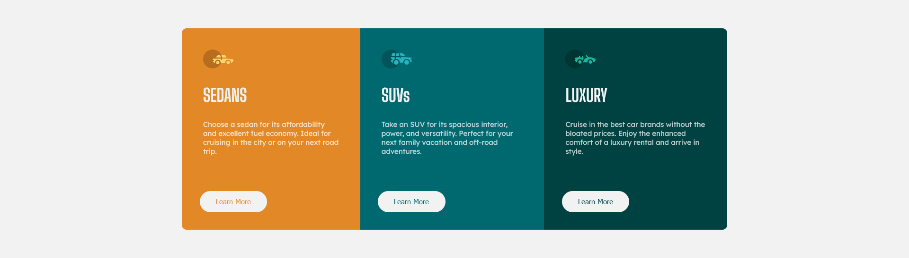
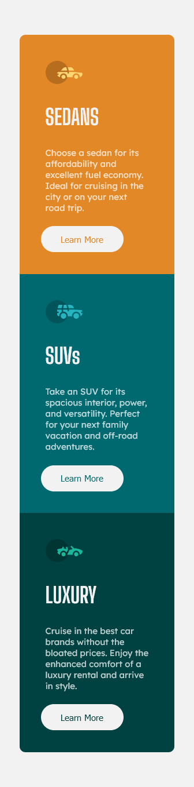

# Frontend Mentor - 3-column preview card component solution

This is a solution to the [3-column preview card component challenge on Frontend Mentor](https://www.frontendmentor.io/challenges/3column-preview-card-component-pH92eAR2-). Frontend Mentor challenges help you improve your coding skills by building realistic projects.

## Table of contents

- [Overview](#overview)
  - [The challenge](#the-challenge)
  - [Screenshots](#screenshot)
  - [Links](#links)
- [My process](#my-process)
  - [Implementation](#implementation-steps)
  - [Built with](#built-with)
- [Author](#author)

## Overview

### The challenge

Users should be able to:

- View the optimal layout depending on their device's screen size
- See hover states for interactive elements

### Screenshot

My attempt's desktop version (1920x1080 screen)

My attempt's mobile version (336px wide screen)

### Links

- Solution URL: [https://github.com/honath/3-column-cards-frontendmentor](https://github.com/honath/3-column-cards-frontendmentor)
- Live Site URL: [https://honath.github.io/3-column-cards-frontendmentor/](https://honath.github.io/3-column-cards-frontendmentor/)

## My process

### Implementation steps

1. First, I wanted to outline the general HTML structure of the page and its elements, assigning class names I may want to use to most of the elements, along with grouping some of the text elements inside of a ``, in case of later additions of text.
2. I then defined CSS variables for the colors, and implemented general padding for the larger base elements. I like to set the background to black for whichever element (main, section, etc) I happen to be sizing out at the start, just to make it easier to see what's happening.
3. After getting general sizing down, I started adding colors to all of the elements, importing the custom fonts for the projects, and adjusting text sizes.
4. Once a lot of the core designs of the elements were implemented, I began to add finer details such as border radius and hover effects to the button, and experiment with padding to get as close as possible to the reference material.
5. After everything on the mobile end was complete and I felt satisfied with the results, I implemented any changes that needed to be made for the desktop/wide view. messed around with window size to test responsiveness and where the mobile/wide view threshold may need to be, for this specific project.
6. Any bugs or oversights that were noticed during responsiveness testing were then promptly squashed :)

### Built with

- Semantic HTML5 markup
- CSS custom properties
- Flexbox
- Mobile-first workflow

## Author

- Website - [My Portfolio](https://honath.github.io/portfolio-acooper/)
- LinkedIn - [My LinkedIn](www.linkedin.com/in/alexander-cooper97)
